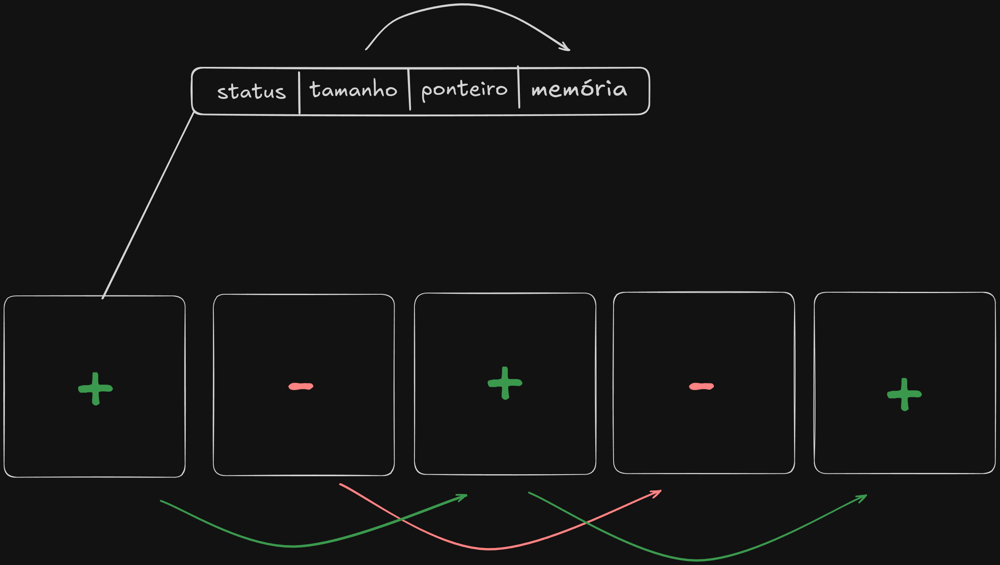
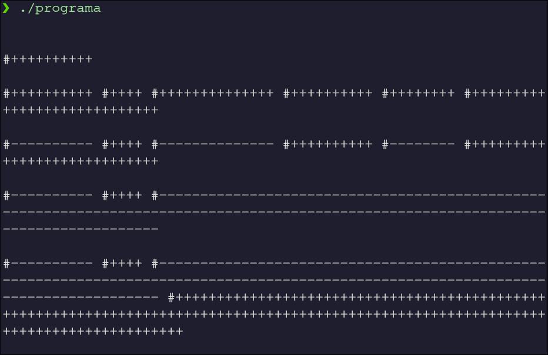

# Heap-em-Assembly

 Esse projeto é uma pequena biblioteca escrita em Assembly que busca simular o comportamento da Heap quando fazemos alocação de memória. Ele serviu para exercitar a escrita em Assembly e exemplificar funcionamento da Heap e dos métodos que a envolve: inicialização do alocador, alocação de blocos de memória, desalocação e gestão eficiente dos blocos livres e não livres.

 ## Modelo

 A arquitetura da Heap é baseada no capítulo 6 do livro 
Execução de Programas: Como funcionam carregadores, ligadores e interpretadores (©2015-2019 Bruno Müller Junior). A ideia geral consiste em obter o endereço atual da Heap por meio da brk e crescer a Heap com base num header de um bloco de memória que pode ser interpretado pelas funções da biblioteca.

### Header do Bloco


 Cada bloco é constituído por um header com as seguintes seções: a primeira indica se o bloco está livre ou ocupado; a segunda indica o tamanho do espaço de memória do bloco (não incluindo o header em si); a terceira contém um ponteiro para o próximo do mesmo tipo, criando assim duas listas encadeadas ( de blocos ocupados e livres); e por fim a última seção é próprio espaço de memória.

## Funcionalidades

### `void IniciaAlocador()`
 Salva o topo inicial da heap e inicializa ponteiros das listas

### `void FinalizaAlocador()`
 Restaura o topo da heap inicial com a syscall `brk`

### `void* alocaMem (int)`
 1. Procura o menor bloco livre com tamanho maior ou igual à num_bytes.
 2. Se encontrar, indica que o bloco está ocupado e retorna o endereço inicial do bloco;
 3. Se não encontrar, abre espaço para um novo bloco, indica que o bloco está ocupado e retorna o endereço inicial do bloco.

### `void liberaMem(void*)`
 Indica que o bloco está livre. Ao liberar um bloco de memória, dois ou mais blocos livres consecutivos fundem-se em um só, ajustando o tamanho e os ponteiros.

### `void ImprimeMapa()`
 Imprime um mapa da memória da região da heap. Para cada bloco são impressos seu status e seu tamanho.

## Uso

### Requisitos
Linux x86-64, NASM/GAS, GCC

### Compilação
 Para compilar a biblioteca:
```bash
gcc -g seu_codigo.c alocador.S
```

### Exemplo
 Junto à biblioteca há um arquivo de exemplo:
 ```
 int main (long int argc, char** argv) {
  void *a, *b, *c, *d, *e, *f, *g, *h;

  iniciaAlocador();              
  imprimeMapa();                

  a = (void *) alocaMem(10);
  imprimeMapa();
  b = (void *) alocaMem(4);
  c = (void *) alocaMem(14);
  d = (void *) alocaMem(10);
  e = (void *) alocaMem(8);
  f = (void *) alocaMem(28);
  imprimeMapa();
                          
  liberaMem(a);
  liberaMem(c);
  liberaMem(e);
  imprimeMapa();
  liberaMem(f);
  liberaMem(d);
  imprimeMapa();
  g = (void *) alocaMem(60 + 73);
  imprimeMapa();
  liberaMem(b);
  imprimeMapa();
  finalizaAlocador();
  ```



